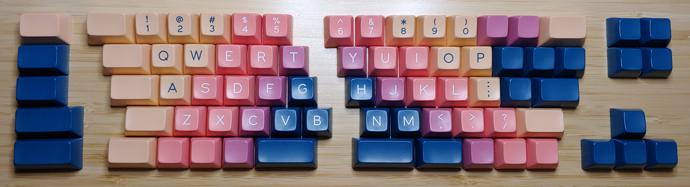
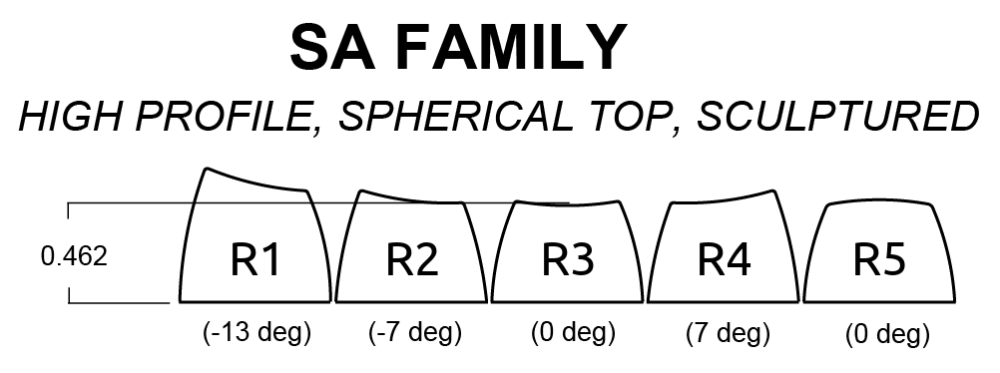

# rescuedox
A horizontally staggered split keyboard that uses a complete set of Ergodox keycaps

## Why?

### tl;dr
- I have a nice set of Ergodox keycaps
- I don't like the Ergodox layout
- I still want to use these keycaps

### Story?
In a fit of carpal tunnel induced wrist pain, I decided to try an ergonomic split keyboard. At the time, Ergodox was one of the more popular split keyboard designs on [r/mk](https://www.reddit.com/r/MechanicalKeyboards/). Parts and (good) complete keycap sets were relatively easy to find, which was important because I really didn't want to go hunting for individual oddly-sized keycaps in oddly-specific colors and profiles to make a complete set. 

I over-eagerly bought a nice set of Ergodox keycaps ([SA Vilebloom](http://www.mechsupply.co.uk/product/sa-vilebloom)) before actually trying an Ergodox keyboard and realizing that I actually can't stand using it. 

#### What's wrong with Ergodox?
1. The columnar stagger doesn't actually help with wrist pain

    The argument for an ortholinear layout or a columnar stagger goes something like "when you extend your finger, it doesn't go sideways, does it? So why are the keys on your keyboard not directly on top of each other? The answer is archaic design." It's true that the traditional horizontally staggered keyboard layout comes from the typewriter. This stagger simplified the design of the lever array underneath the typewriter's keyboard. It's also true that your fingers don't move sideways when you move them up and down (duh?). 
    
    However, I'm not convinced that moving your fingers from side to side is actually associated with wrist pain. The muscle tendons that move your fingers up and down are routed through the carpal tunnel, which is a ring of bones and ligaments in your wrist. You can feel your carpal tunnel change shape as your tendons tighten and loosen by moving your fingers up and down while your other hand is wrapped around your wrist. But if you move your fingers from side to side, there is almost no change in tension or movement in the carpal tunnel. 

2. The columnar stagger is infuriating

    The QWERTY layout feels familiar, but the keys are offset *just* enough to make me miss when typing quickly. I've heard that you get used to this, but I'm not sure if getting used to this also means getting thrown off when returning to a computer with a standard keyboard layout (e.g. a laptop, a computer at work, someone else's computer). 
    
3. Programming keys are an afterthought

    When programming, the `` ` ``, `~`, `_`, `-`, `=`, `+`, `[`, `{`, `]`, `}`, `|`, `'`, and `"` symbols are heavily used. Obviously there are plenty of extra keys that these symbols *could* be mapped to, but the layout makes it difficult to map many of them anywhere close to their standard positions. So not only will you miss, you'll be on the wrong side of the keyboard, so correcting the miss will mean looking down, not seeing the key you wanted half a cm to the left, and then remembering that it's actually in your thumb cluster. I've wasted enough time being annoyed by cmd / ctrl muscle memory when switching between a Mac and a PC, and that's just one key... doing this with 20% of the keyboard doesn't seem like a good idea. 

#### Okay, so now what?
I still want to use these keycaps, but I want a keyboard with a slightly less insane layout. Short production run group buys being what they are, all other variants of this keycap set are completely sold out, so I probably won't be able to find the additional keys I'd need to fit most other keyboard designs. So this is a split keyboard designed for a complete set of Ergodox keycaps, but that arranges them using the more typical horizontal stagger. 

## Layout
The mockup image above represents the layout I currently have in mind, but this may change. 

### Layout Constraints
SA keycaps have a sculpted profile (keys in different rows have a slightly different shape):

I'd like the keys in the central area to use the correct key shape for their given row. This works out fine for the double-shot keys (letters, numbers, `,`, `.`, `/`, and `;`) but places some constraints on the modifiers, tab, caps lock, shift, enter, backspace, `~`, `-`, `=`, `[`, `]`, `\`, and `'`. None of the SA Vilebloom keycaps use R5, so all keys in the bottom position use R3 instead. R2 and R4 are interchangable if the key can be placed upside-down. 

The arrow cluster currently uses the correct profile (R3 for left, down, right, and R4 for up), but I don't mind if these are all flat (R3). The quad above the arrow keys is currently all flat. The stack of keys on the far left is currently all flat (R3), except for an R2 at the top, even though this position would normally have an R1. 

Judging by the shiny worn-out spot on the spacebar of my current keyboard, I mostly use my left thumb for space, centered below `v`, and extending halfway across `c` and `b`, so I'm placing a half-spacebar there, and hoping that still works when the keyboard is split and slanted. I'm not super confident that this is still a good spot -- it seems like ofsetting the spacebar keys outwards and downwards (like on Ergodox) may be better. Keeping my thumb too far inwards does seem to hold some tension in my wrist. 

## Design

- Wired USB or Bluetooth

    I want this keyboard to function as either a USB or BLE HID keyboard, without needing to change firmware when switching modes. You should be able to walk up to a PC, plug in the keyboard with a USB cable, and just start using it. Similarly, you should be able to pair the keyboard with a computer via BLE and also just start using it. A switch or key combination to switch between modes is fine. 

    My current plan is to use the Rigado (now u-blox) BMD-340 module, which use the nRF52840 from Nordic Semiconductor. I've used this module at work, and have found Nordic's BLE stack and power management to be quite good. The design will also need a battery and battery charging / monitoring circuitry. A USB type-C physical connector will be used for the USB 2.0 connection and for charging. The charger will probably use high current (5V, 3A) when available, but will not use power delivery.

- Either half should be usable independently of the other half

    If you only want to use the left or right half of the board (e.g. if you want to attach the left half to an armrest while gaming), this needs to work without any drama. As with the full keyboard, you should be able to use this half keyboard via USB or BLE. 

    This means that (except for the switch matrix) the circuitry on the left and right boards will probably be pretty close to identical. Each half will also need its own battery. 

- The cable connecting the left and right sides of the keyboard should be optional

    If you're using the keyboard in wired USB mode, and your operating system supports multiple keyboards, and you have two free USB ports, you should theoretically be able to plug each half into the host directly using separate USB cables. In practice, however, this may not work very well, and it certainly isn't very convenient. So instead, you will also be able to connect the two halves toegether (probably using a TRRS-style cable), and then plug either half into the host using a single USB cable. It will enumerate as a single USB HID keyboard containing all of the keys on both halves. 
    
    The same concept applies when using the keyboard in BLE mode. You can pair either/both halves with the host as independent half-keyboards, or you can connect the two halves together with the TRRS cable and configure either half to communicate with the host as a single full keyboard. 
    
    I'd like to be able to use the keyboard in fully wireless mode -- BLE connection, and no TRRS cable between the keyboard halves. I don't know how well having two BLE keyboards paired with one host works in practice. Certain BLE complications (connection intervals, sleep timers, etc.) may make this frustrating on some operating systems. If this ends up being the case, it may be possible to configure one half of the keyboard to maintain a BLE connection with the host (as a single, complete HID keyboard), while simultaneously maintaining a separate wireless connection with the other half of the keyboard (as a "wireless TRRS cable"). 

- Pass-through power / battery balancing

    When a keyboard half is connected to power via USB, it will charge its own battery. If the TRRS cable is connected, and the other keyboard half is *not* connected to power via USB, power will be made available to the unpowered board via the TRRS cable so that it can charge its battery. 
    
    In most cases, I'd expect the left and right batteries to deplete at roughly the same rate. However, if one half is used more frequently than the other, or if one battery becomes degraded prematurely, then one half will need to be charged more frequently than the other. Even when both halves are connected via the TRRS cable, the combined unit will need to be charged more frequently than is optimal. Therefore it may be nice to also allow battery balancing via the TRRS cable, i.e. one half will provide power to the other half, even when neither is connected to external power via USB. 
